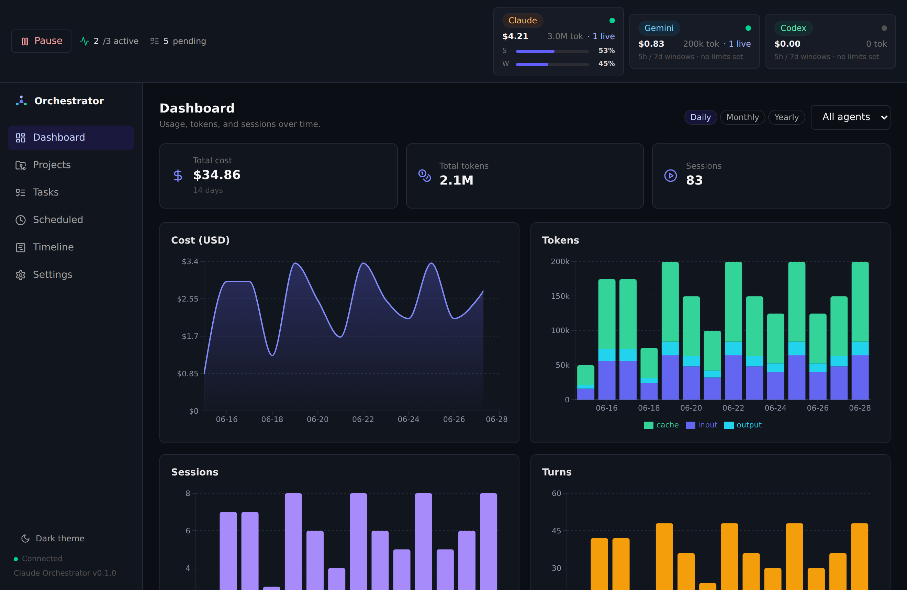
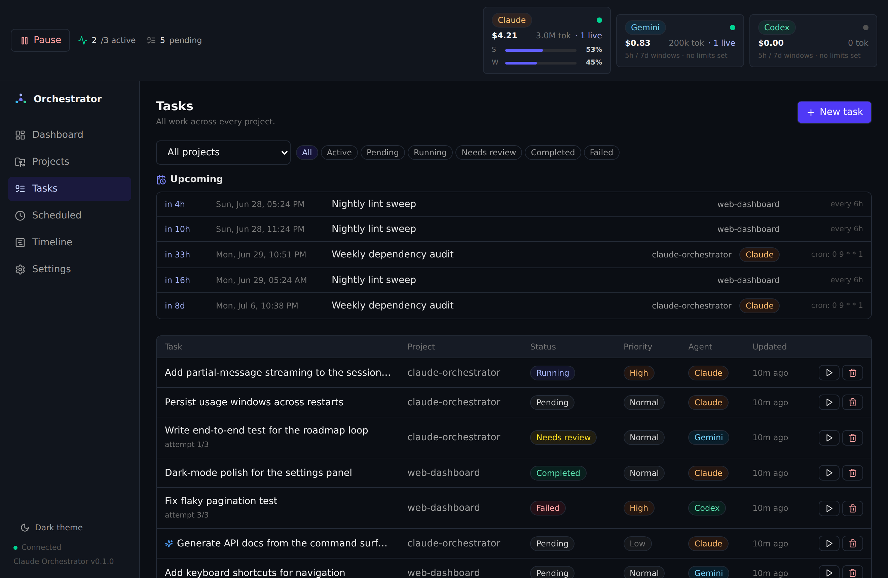
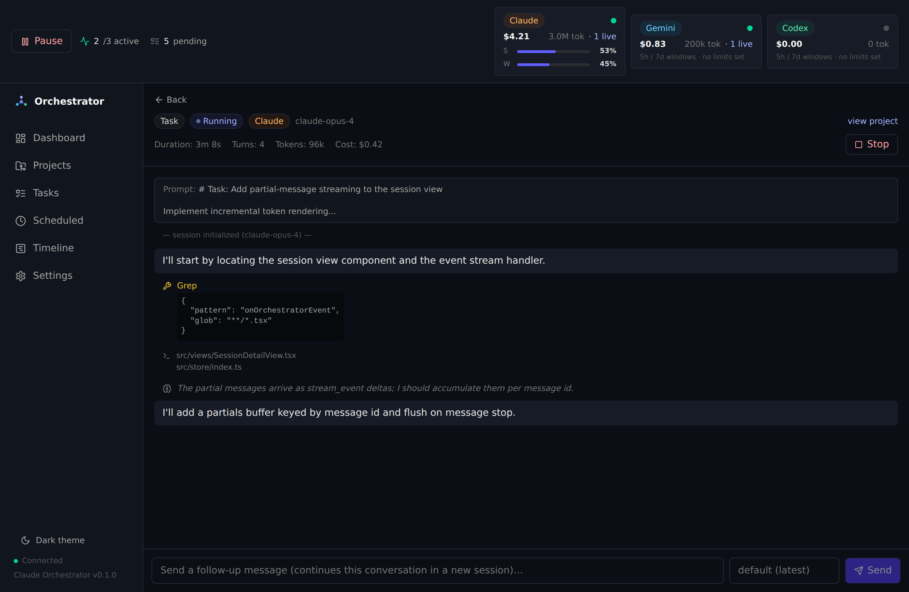
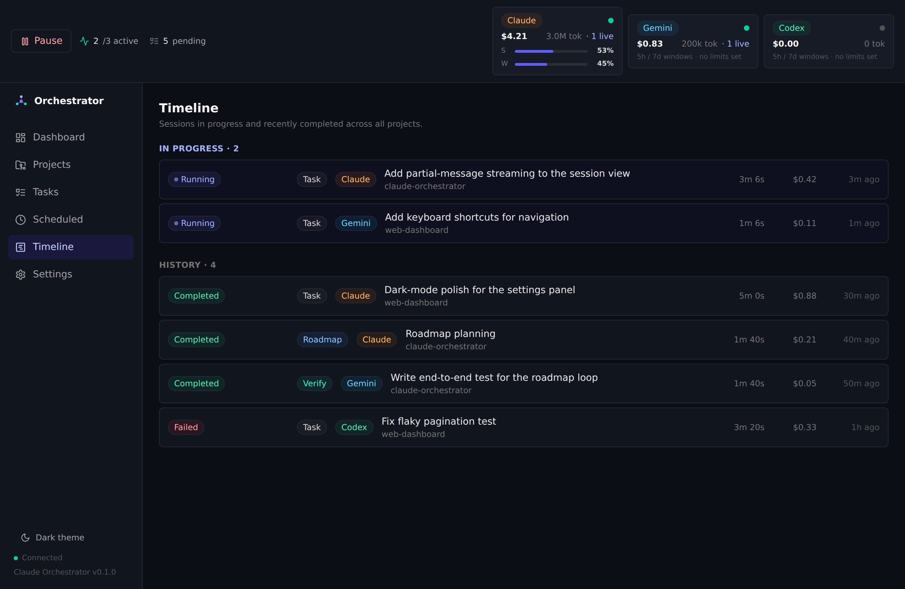
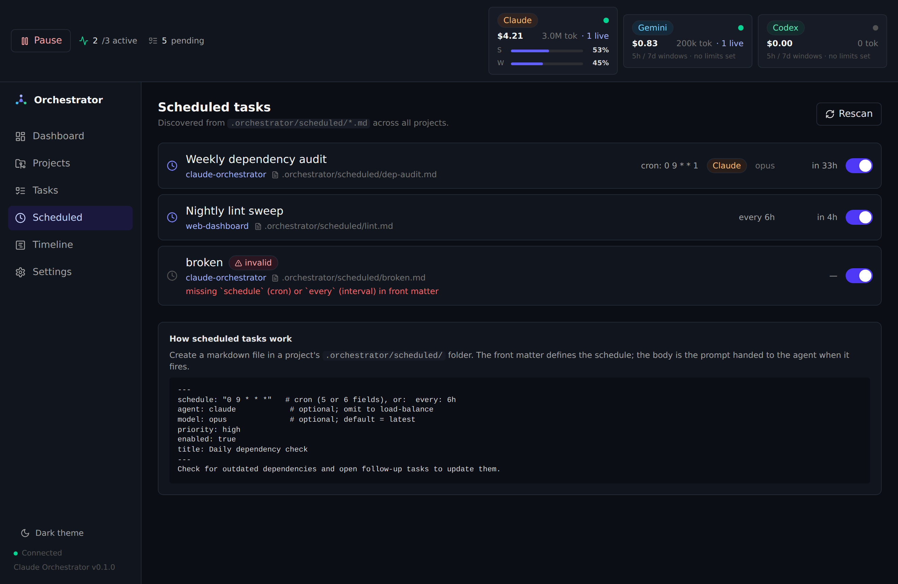

<div align="center">


# Claude Orchestrator

**Run a fleet of autonomous coding agents — Claude Code, Gemini CLI, and Codex CLI — across all your local git repositories, from one cross-platform desktop app.**

Queue tasks, let agents work in parallel, generate their own roadmap, verify their own output, and watch it all stream live — with per-agent usage and cost tracking built in.

[](https://github.com/marius-bughiu/claude-orchestrator/actions/workflows/ci.yml)
[](https://github.com/marius-bughiu/claude-orchestrator/actions/workflows/release.yml)
[](https://github.com/marius-bughiu/claude-orchestrator/releases/latest)
[](LICENSE)


<br/>



</div>

---

## What it does

Claude Orchestrator is a **control plane for autonomous AI coding agents**. Point it at your local git repositories, give it work (or let it generate its own), and it schedules that work across concurrent agent sessions — entirely hands-off, or with you in the loop.

- 🗂️ **Multi-project** — manage many local git repos from one place.
- ✅ **Task queue** — per-project and global, with priorities, dependencies, and retries.
- ⚙️ **Autonomous scheduler** — allocates pending tasks to concurrent sessions; configurable concurrency globally and per project.
- 🤖 **Multi-agent** — Claude orchestrates; **Gemini** and **Codex** are delegable sub-agents (per-project allowed-agent set, Claude-only by default). Every CLI runs with streaming JSON, parsed into a unified event stream.
- ⚖️ **Usage-balanced dispatch** — unpinned work routes to the least-used agent, so it sheds from Claude to Gemini/Codex as usage runs ahead.
- 🔁 **Roadmap loop** — when a project's queue empties, an agent proposes the next batch of work.
- 🔍 **Self-verification** — finished tasks are independently checked against their acceptance criteria; failures are re-queued with feedback.
- ⏰ **Scheduled tasks** — recurring jobs defined as markdown files with a cron/interval in front matter, discovered automatically.
- 📊 **Dashboards & usage tracking** — cost, tokens, sessions, and turns per day / month / year, plus a top-bar showing **session and weekly % of your limits** for every agent.
- 🛰️ **Live timeline** — every session in progress and completed, with token-by-token streaming and the ability to inject follow-up messages.
- 🌗 **Polished desktop UI** — light & dark themes, a real-time event feed, and a native cross-platform shell.
- ⬆️ **Auto-updating** — ships a new release on every push to `main`; the app detects it, drains running work gracefully, then updates and restarts.

## How the agent loop works

```
pending task ──► agent session (streaming) ──► verify goal met?
     ▲                                              │
     │ no (re-queue with feedback)  ◄───────────────┤
     │                                              │ yes ──► done
     └──◄── roadmap loop generates new tasks ◄── queue empty?
```

The scheduler continuously looks for schedulable work, respects global/per-project
concurrency limits, runs the roadmap loop when a project runs dry, and verifies
each result before marking it complete.

## Screenshots

| Tasks & upcoming schedule | Live agent session |
|---|---|
| [](docs/screenshots/tasks.png) | [](docs/screenshots/session.png) |

| Timeline | Scheduled jobs |
|---|---|
| [](docs/screenshots/timeline.png) | [](docs/screenshots/scheduled.png) |

<sub>Light theme is built in too — every view adapts.</sub>

## Architecture

A platform-independent Rust engine with a thin Tauri shell and a React UI:

```
crates/core/   orchestrator-core — engine, SQLite, agent adapters, scheduler (no GUI deps)
  ├─ models.rs        data model            ├─ runner.rs     streaming process runner
  ├─ db/              SQLite persistence     ├─ engine.rs     scheduler / roadmap / verify
  ├─ agents/          Claude·Gemini·Codex    ├─ scheduled.rs  cron/interval scheduled tasks
  └─ parse.rs         output contracts       └─ conventions.rs  .orchestrator/ files
src-tauri/     Tauri host — IPC commands, event bridge, updater
src/           React + TypeScript + Tailwind — views, zustand store, charts
```

See [`docs/ARCHITECTURE.md`](docs/ARCHITECTURE.md) for the full design.

## Quick start

**Prerequisites**

- [Rust](https://rustup.rs/) (stable) and [Node 22](https://nodejs.org/) + [pnpm](https://pnpm.io/)
- The [Claude Code CLI](https://docs.claude.com/en/docs/claude-code) (`claude`) — required. Gemini and Codex CLIs are optional sub-agents, auto-detected on your `PATH`.
- On Linux, the WebKit dev libraries:
  ```bash
  sudo apt-get install -y libwebkit2gtk-4.1-dev libsoup-3.0-dev \
    libjavascriptcoregtk-4.1-dev librsvg2-dev libgtk-3-dev
  ```

**Run it**

```bash
pnpm install
pnpm tauri dev      # launch the desktop app in development
```

**Build installers**

```bash
pnpm tauri build    # produces native installers for your platform
```

**Or just download** the latest installer for macOS / Windows / Linux from the
[Releases page](https://github.com/marius-bughiu/claude-orchestrator/releases/latest).
The app keeps itself up to date automatically.

## Using it

1. **Add a project** — pick a local git repo. The app scaffolds an `.orchestrator/`
   folder with sensible defaults.
2. **Create tasks**, or enable the **roadmap loop** and let the project generate its own.
3. Pick allowed agents and a model per task (defaults to the latest Opus for Claude).
4. Press **Run**. Watch the timeline, dashboards, and per-agent usage fill in.

### Per-project configuration

Each repo can carry an `.orchestrator/` directory that steers autonomous behavior —
roadmap and verification prompts, a task preamble, allowed agents, and recurring
**scheduled tasks**. Every file is optional with built-in defaults. See
[`docs/CONVENTIONS.md`](docs/CONVENTIONS.md).

## Releases & auto-update

Every push to `main` publishes a signed, cross-platform release; the desktop app
checks for it on launch and updates gracefully (draining in-flight work first).
See [`docs/RELEASING.md`](docs/RELEASING.md) for the signing-key setup.

## Self-hosted

This repository is maintained by Claude Orchestrator itself — its own
[`.orchestrator/`](.orchestrator) directory defines the roadmap, verification, and
scheduled jobs that keep the project moving. Contributors and agents should read
[`CLAUDE.md`](CLAUDE.md).

## Contributing

Issues and PRs welcome. Run the checks before pushing:

```bash
cargo test -p orchestrator-core
cargo clippy -p orchestrator-core --all-targets -- -D warnings
cargo fmt --all -- --check
pnpm build
cargo check -p claude-orchestrator   # needs the Linux WebKit dev libs
```

## License

[MIT](LICENSE) © Marius Bughiu
